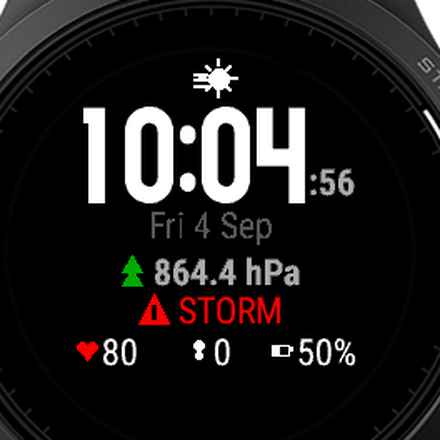
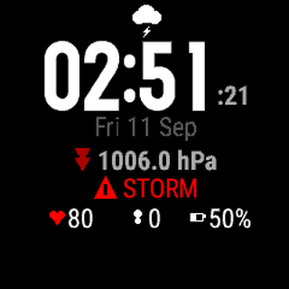
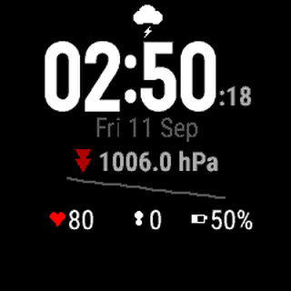
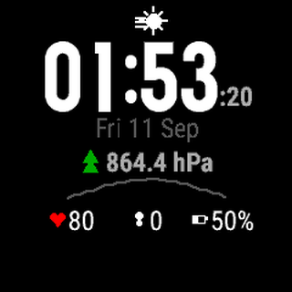
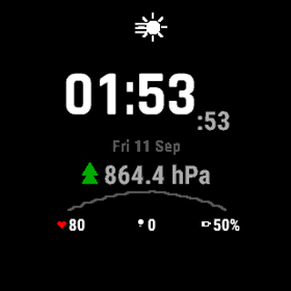
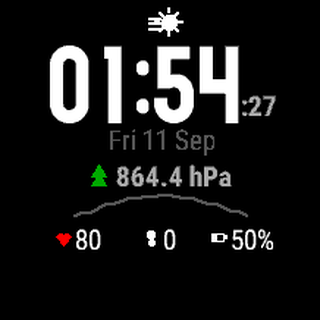
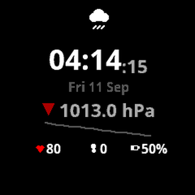
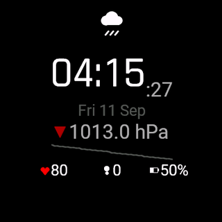
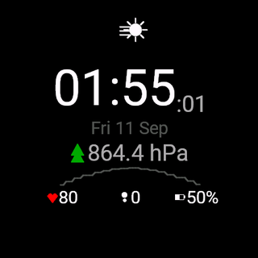
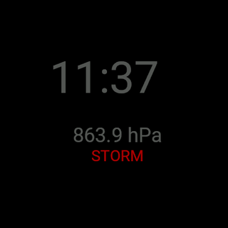

# BaroBuddy

[](LICENSE)
[](https://developer.garmin.com/connect-iq/overview/)
[](https://developer.garmin.com/connect-iq/api-docs/)
[](https://developer.garmin.com/connect-iq/monkey-c/)
[](#supported-devices)
[](#running-the-tests)
[](#building-from-source)

A barometric weather watch face for Garmin Connect IQ devices.

BaroBuddy forecasts the next few hours of weather the way a ship's barometer
does: not from the absolute pressure, but from **how fast and in which
direction it is changing**. It keeps six hours of pressure history on the
watch, fits a trend through it, and turns that trend into an icon, an arrow and
a plain-language outlook — with a separate alert for the rapid pressure drop
that precedes a storm.

No phone, no internet connection and no weather service are involved. The
forecast is computed entirely on the watch from its own barometer.



*Simulator screenshot of a Forerunner 935, cropped to the display. The
simulated barometer is a random walk, which is why the pressure reads 864 hPa —
see [Notes on the reading](#notes-on-the-reading).*

## Why a barometer, when the phone already has weather

A phone forecast is a statement about a region, computed hours ago, somewhere
else, by someone else — and it reaches you only if a cell tower does. A
barometer is a statement about the column of air directly over your head, made
continuously, by an instrument strapped to your wrist.

In town, with four bars of signal, the phone wins every time. BaroBuddy is for
the hours when the phone isn't the one answering.

**The valley with no bars.** Terrain that is worth walking into is terrain that
blocks signal. You drop below a ridge at nine in the morning with a forecast
that was already six hours old, and the next time your phone has anything to
say is when you climb out again. The air above you does not go quiet. If the
pressure has fallen 4 hPa since breakfast, something is coming, and you know it
before the sky says so.

**The phone that stayed behind.** In the car, on the charger, in the bottom of
a pack under everything else, or simply dead by mid-afternoon in the cold. The
watch is the one instrument you never take off, and it has been sampling the
whole time regardless.

**The morning that looked fine.** The worst decisions in the mountains are made
in good weather — a fast-moving front is often invisible for hours before it
arrives, but it is never silent on a barometer. A pressure drop of a few hPa
over three hours is the earliest warning any instrument can give you, and it
arrives while you still have the option of turning around, dropping to a lower
route or getting the tent up on ground you chose rather than ground that chose
you.

**The night in the hut.** No reception, no plug, a long walk out in the
morning, and a decision to make about which way to take. Six hours of pressure
history on your wrist is a better basis for it than yesterday's forecast and a
look out of the window.

None of this asks anything of you. There is no app to open, no refresh to wait
for, no battery-hungry radio. You look at your watch to check the time, and the
sky's intentions are already there in the corner of the screen.

### What it can and cannot tell you

Be clear about what you are reading. A barometer measures one thing extremely
well: the direction and rate of change of local pressure, which is a genuine
leading indicator of weather over roughly the next six to twelve hours. It
knows nothing about where a front is coming from, whether the precipitation
will be rain or snow, or how cold it will get. It is an early warning, not a
forecast in the meteorological sense, and it works best as a reason to look up,
check the sky and reconsider a plan.

One caveat matters more than the rest, and it is not a shortcoming of this app
so much as of physics: **pressure falls as you climb**. Roughly 1 hPa per 8.5
metres of ascent near sea level. Gain 300 metres and the watch sees a fall of
about 35 hPa — far larger than any weather signal, and it will read as a storm.
The trend is meaningful when you are staying put, or moving across roughly
level ground: a camp, a hut, a valley walk, a boat, a night's sleep. On a long
climb, read the reading, not the trend, and take the forecast seriously again
once you have settled at an altitude.

And the obvious one: a watch face is not safety equipment. Take the map, the
shell layer, the head torch and the means to call for help anyway.

## Features

- **Six-hour pressure trend** from the watch's own barometer, expressed in
  hPa per 6 hours and classified into five forecast states.
- **Storm alert** on a rapid three-hour pressure drop, with hysteresis so it
  does not flicker and a re-arm window so it does not nag. Its threshold is set
  on the same scale as the watch's own Storm Alert, so the two can be made to
  agree — see [Living with the watch's own Storm
  Alert](#living-with-the-watchs-own-storm-alert).
- **History priming.** On first run the face fills its buffer from
  `SensorHistory`, so it is useful within minutes of installation instead of
  after six hours of wear.
- **Pressure graph** of the recent trace, drawn from the same buffer.
- **Bottom status row** of three cells, each one set to whatever you want it
  to show: heart rate, steps, battery, calories, distance, floors climbed,
  notifications — or nothing at all.
- **Configurable** from the Garmin Connect app: units (hPa / inHg / mmHg),
  which rows to show and what the status row holds.
- **Low-power aware.** In gesture-off mode only the seconds rectangle is
  redrawn, and the graph is dropped entirely.

## The layout

Nothing is drawn at fixed pixel coordinates. The display is round, so a layout
designed for a 240×240 rectangle would put its corners off screen. Every
position is stacked top to bottom in `onLayout()` from the real font metrics
and kept inside the circle, which is also what lets the same source render on
eleven devices with five different screen sizes.

| Row | Content |
| --- | --- |
| Icon | Forecast: sun / sun behind cloud / cloud / rain / lightning |
| Time | Largest number font that fits the screen, with smaller seconds tucked to its right |
| Date | `Fri 4 Sep` |
| Pressure | Trend arrow, coloured by direction, then the reading and its unit |
| Graph **or** storm | The recent pressure trace; during a storm a red banner takes its place |
| Status | Three configurable cells, heart rate / steps / battery by default |

The banner replaces the graph deliberately: during a storm the warning matters
more than the curve that led to it.

Each cell of the status row can be pointed at a different field, and a cell set
to *Off* is dropped entirely — the remaining ones then spread across the whole
row instead of leaving a gap:

| Field | Shows |
| --- | --- |
| Off | Nothing; the cell is not drawn |
| Heart Rate | Live heart rate, falling back to the last logged sample |
| Steps | Today's step count, abbreviated to `8.4k` only when it will not fit |
| Battery | Charge, red below 15% |
| Calories | Today's calories, active plus resting |
| Distance | Today's distance in km or miles, following the watch's own unit |
| Floors Climbed | Floors from the same barometer the rest of the face runs on |
| Notifications | Notifications waiting on the phone |

The icons are drawn from primitives rather than loaded as bitmaps, which is
what keeps eight of them affordable inside the FR935's watch face memory.

## How the forecast works

Pressure is sampled once a minute and offered to a 24-slot ring buffer that
enforces a minimum spacing of 15 minutes between stored samples, so a full
buffer spans six hours in roughly 200 bytes. A least-squares regression over
the buffer gives the trend, normalised to hPa per six hours:

| Trend (hPa / 6 h) | State | Label |
| --- | --- | --- |
| above +3.0 | Rising fast | Windy / Clearing |
| +0.5 to +3.0 | Rising | Fair |
| −0.5 to +0.5 | Steady | Steady |
| −3.0 to −0.5 | Falling | Rain likely |
| below −3.0 | Falling fast | Storm warning |

No forecast is shown until the buffer covers at least one hour. Extrapolating a
six-hour tendency from a few minutes of data is noise, and showing it would be
worse than showing nothing.

The **storm alert is independent of the forecast**. It watches the drop of the
latest reading below the mean of the last three hours, over at least five
samples, and will not re-latch for another three hours once it has fired.

Its threshold is a setting, given in the same units as the watch's own Storm
Alert: hPa of fall over three hours, from 2 (sensitive) to 6 (quiet), with 3 —
the classic "pressure fell 3 hPa in 3 hours" criterion — as the default. Set it
to whatever the watch is set to under *Sensors & Accessories → Altimeter →
Storm Alert* and the banner and the system alert will fire together. Internally
the setting is halved, because the drop is measured against the window mean
rather than its first sample, so a 3 hPa setting becomes a 1.5 hPa trigger; the
warning clears again at two thirds of that, and the gap is what stops it
flickering around the threshold.

Both of these are the same face on the same history — a steady 7 hPa fall over
six hours, which reads as a 1.8 hPa drop against the three-hour window mean.
Only the setting differs:

| Storm Threshold: 2 hPa / 3 h | Storm Threshold: 6 hPa / 3 h |
| --- | --- |
|  |  |
| The drop clears the 1.0 hPa trigger, so the banner takes the graph's row | The same drop is short of the 3.0 hPa trigger, so the graph stays |

The forecast row is unaffected either way: the trend is falling fast in both,
because the threshold governs the alert and not the six-hour tendency.

The two measures can disagree: pressure that fell sharply and has begun
recovering will show a rising trend while the storm is still latched. That is
intended, not a bug — one describes where the pressure is going, the other what
it just did.

### Living with the watch's own Storm Alert

Most barometric Garmins have a Storm Alert of their own, in the firmware, under
*Settings → Sensors & Accessories → Altimeter → Storm Alert* (on some models
*Barometer* rather than *Altimeter*). It watches the same barometer BaroBuddy
does and buzzes when the pressure falls faster than the rate you set there.

**The two cannot talk to each other.** Connect IQ exposes no API for the
built-in alert: there is no way to read whether it is switched on, no way to
read its threshold, and no event when it fires. Nothing in the SDK mentions it —
the only place the word "storm" appears at all is the list of
`Toybox.Weather` forecast conditions, which is the phone's forecast and not the
barometer. So BaroBuddy can neither suppress its banner because the watch has
already warned you, nor raise one because the watch did.

What they do share is the data. BaroBuddy primes its buffer from
`SensorHistory`, the same barometer record the firmware watches, so the two are
looking at identical numbers and only the rules differ. Setting both to the
same threshold is therefore all the coordination that is available — and it is
enough in practice.

They are also good at different halves of the job:

| | Watch's Storm Alert | BaroBuddy's banner |
| --- | --- | --- |
| Can vibrate or beep | Yes | **No** |
| Visible without an alert popup | No | Yes, on the face and on the always-on screen |
| Tells you it is *still* falling | No, it fires once | Yes, the banner stays while the drop persists |
| Threshold | Set on the watch | Set in Garmin Connect, same scale |

A watch face is refused `Toybox.Attention` outright — the module's supported
runtime contexts are data fields, glances, widgets, watch apps and audio
providers, and a watch face is not among them — so BaroBuddy's warning is
visual only, and you see it when you look at your wrist. The firmware alert is
the only one of the two that can reach you when you are not looking.

**The recommendation is to leave both on**, set to the same number. The system
alert wakes you; the banner is the persistent "it is still dropping" state you
see every time you check the time, including at a glance on the FR965's
always-on screen. If the thresholds are left different, the banner may appear
without a buzz or a buzz arrive without a banner — not a malfunction, just two
independent rules on one barometer.

## Supported devices

| Device | Screen | Launcher icon |
| --- | --- | --- |
| fēnix 8 47mm and 51mm, tactix 8 47mm and 51mm, quatix 8 47mm and 51mm | 454×454 AMOLED | 65×65 |
| Forerunner 965 | 454×454 AMOLED | 65×65 |
| fēnix 8 43mm | 416×416 AMOLED | 60×60 |
| Enduro 2, fēnix 7X, tactix 7, quatix 7X Solar | 280×280 | 40×40 |
| Forerunner 935 | 240×240 | 40×40 |
| vívoactive 3 | 240×240 | 40×33 |
| fēnix 5 | 240×240 | 40×40 |
| fēnix 5X | 240×240 | 40×40 |
| D2 Charlie | 240×240 | 40×40 |
| fēnix 5S | 218×218 | 36×36 |
| fēnix Chronos | 218×218 | 36×36 |

| | | |
| --- | --- | --- |
|  |  |  |
| Forerunner 935, 240×240 | fēnix 7X, 280×280 | fēnix 5S, 218×218 |
|  |  |  |
| vívoactive 3, 240×240 | fēnix 8 43mm, 416×416 | Forerunner 965, 454×454 |

One screenshot per screen size the app ships for. Nothing is scaled: every row
is placed from the font metrics of the device it is drawn on, which is why the
clock font differs between them — the vívoactive 3 and the Forerunner 935 have
the same 240×240 screen and still do not draw the same clock. The AMOLED
devices also have a second face for when they sleep:



These are simulator screenshots, cropped to the display with
`tools/crop_screenshot.py`. The simulated barometer is a random walk, which is
why the pressure reads 864 hPa — see
[Notes on the reading](#notes-on-the-reading).

Eleven Connect IQ device profiles cover the list above: the four devices on
the fēnix 7X row share `fenix7x` and the six on the fēnix 8 47mm row share
`fenix847mm`, so a single build covers each row. The only thing the extra
resource buckets hold is the launcher icon — one per icon size, plus
`resources-vivoactive3` for the single target whose icon is not square —
because everything the face draws is laid out from the device's own metrics at
run time rather than from a per-screen layout file.

The fēnix 8 and Forerunner 965 rows are AMOLED and are drawn differently while
they sleep, which the design notes below explain; the rest are 64-colour MIP
displays. All run Connect IQ API 3.0.0 or later, which is what the app
targets. The Forerunner 935 is the reference device: where a trade-off has to
be made, it is made in favour of the FR935.

The clock font is not the same on every device. Font sizes are a device
decision, and the fēnix 7X family draws the largest number font at 44% of the
screen height against the FR935's 24%, which would leave no room for the rest
of the stack. `onLayout()` therefore measures the candidates and takes the
largest one that fits inside 28% of the screen. That is why the vívoactive 3
clock is smaller than the FR935's on the same 240×240 screen: its two largest
number fonts measure 39% and 31%, both over the limit, so the face settles for
the 20% one.

The only permission the app requests is `SensorHistory`.

## Installing

Download `BaroBuddy-<device>.prg` for your watch, connect the watch by USB, and
copy the file into the `GARMIN/APPS/` folder of the drive that appears. Eject
the drive and disconnect. The face then shows up under long-press `UP` →
*Watch Face*.

## Settings

Configurable from the Garmin Connect app under the watch face's settings:

| Setting | Default | Effect |
| --- | --- | --- |
| Show Seconds | on | Seconds beside the time, redrawn by the partial-update path |
| Show Pressure Graph | on | The pressure trace row |
| Storm Warning Banner | on | The red storm banner |
| Storm Threshold | 3 hPa / 3 h | Fall that raises the warning, 2 to 6 hPa over three hours |
| Pressure Unit | hPa | hPa, inHg or mmHg |
| Bottom Left Field | Heart Rate | Left cell of the status row |
| Bottom Middle Field | Steps | Middle cell of the status row |
| Bottom Right Field | Battery | Right cell of the status row |

An unrecognised value — from a newer settings page than the installed face —
is clamped back to the default rather than passed on: an unknown unit reads as
hPa, an out-of-range storm threshold as 3 hPa, and an unknown status field as
whatever that cell shows out of the box.

## Building from source

Requires the [Connect IQ SDK](https://developer.garmin.com/connect-iq/sdk/) and
a developer key.

```bash
export PATH="/path/to/connectiq-sdk/bin:$PATH"

monkeyc -f monkey.jungle -d fr935 -o bin/BaroBuddy-fr935.prg \
        -y ~/.garmin/developer_key.der -w -l 3
```

- `-l 3` is the strictest type checker. The project builds clean at that level
  with no warnings, in both debug and release, on all eleven devices.
- `-r` produces a release build (about 24 kB per device).
- `-e` together with an `.iq` output produces a store-ready package for all
  devices at once.

To generate a developer key, if you do not have one:

```bash
openssl genrsa -out developer_key.pem 4096
openssl pkcs8 -topk8 -inform PEM -outform DER \
              -in developer_key.pem -out developer_key.der -nocrypt
```

The launcher icons are generated rather than hand-drawn:

```bash
python3 tools/make_launcher_icon.py
```

## Running the tests

```bash
monkeyc -f monkey.jungle -d fr935 -o bin/BaroBuddyTest.prg \
        -y ~/.garmin/developer_key.der --unit-test -w -l 3

monkeydo bin/BaroBuddyTest.prg fr935 -t
```

62 tests covering the buffer arithmetic, the forecast thresholds and their
boundaries, the storm hysteresis and re-arm window, the unit conversions, the
settings validation, the `Application.Storage` round trip, and eight render
smoke tests that draw the full face into an off-screen `BufferedBitmap`.

The render tests cannot say whether the face *looks* right, but they catch what
a static review does not: a null dereference in a branch that only runs during
a storm, a polygon built from a negative size, a resource id that no longer
resolves. Every state is exercised, including the empty first-run buffer, every
status field in every cell, a status row with all three cells switched off, and
a full sleep/wake cycle.

Run a single test with `monkeydo bin/BaroBuddyTest.prg fr935 -t <test_name>`.

## Running in the simulator

```bash
connectiq &                                     # start the simulator
monkeydo bin/BaroBuddy-fr935.prg fr935          # load the face into it
```

The simulator's barometer is a random walk rather than a plausible pressure
series, so the forecast it produces is not meaningful. What it is good for is
the layout, the settings, the sleep transitions and the storage behaviour.

Note that the simulator keys `Application.Storage` by the application name from
the manifest, and a `--unit-test` build gets a `Test` suffix — so the test
build and the app build have separate stores and cannot seed each other.

## Project layout

```
source/
  BaroBuddyApp.mc         AppBase: lifecycle, settings changes, save on exit
  BaroBuddyView.mc        The face: sampling, state, layout and all drawing
  BaroBuddyDelegate.mc    WatchFaceDelegate: the power budget callback
  PressureBuffer.mc       Ring buffer, regression trend, drop detection, serialisation
  WeatherPredictor.mc     Trend to forecast state, arrows, labels
  StormMonitor.mc         Latching storm alert with hysteresis and a re-arm window
  PressureFormatter.mc    hPa / inHg / mmHg conversion and formatting
  StatusField.mc          Ids for what each status row cell shows
  AppSettings.mc          Typed, validated access to the property store
  *Test.mc                Unit and render tests, excluded from shipping builds
resources/                Strings, settings, properties, 40x40 launcher icon
resources-round-218x218/  36x36 launcher icon for the smaller screens
resources-round-454x454/  65x65 launcher icon for the FR965 and fenix 8 47mm
resources-round-416x416/  60x60 launcher icon for the fenix 8 43mm
resources-vivoactive3/    40x33 launcher icon, the one target that is not square
tools/                    Launcher icon generator, screenshot cropper
docs/screenshots/         Per-device simulator screenshots used in this README
docs/store/               Native resolution screenshots for the Store listing
monkey.jungle             Build configuration: manifest and language buckets
```

## Design notes

A few decisions that are not obvious from the code:

**The AMOLED screen goes dark on its own terms.** A panel with burn-in
protection is not allowed `onPartialUpdate()` at all, and a sleeping face that
lights more than a tenth of the screen's luminance gets switched off by the
system. So on the AMOLED devices — the Forerunner 965 and the fēnix 8 — the face
detects
`DeviceSettings.requiresBurnInProtection`, gives up partial updates outright,
and replaces the sleeping face with a stripped one: the time and the reading in
grey, plus the storm warning if one is latched, and nothing else. The whole
group walks a four-step diamond of six pixels with the minute, so no pixel
stays lit from one minute to the next. Measured off a simulator screenshot of
the worst case — storm banner included — that screen draws 1.2% of the panel's
luminance with 4.5% of its pixels on, against a budget of 10%.

**English is registered as a language of its own.** Strings in an unqualified
`resources/` directory are the base language, which the runtime falls back to
for any language the app does not ship. Garmin Connect, though, reads the
labels for the settings screen out of the language buckets of the store
package, and an app whose only bucket is the base language leaves that lookup
with nothing to match on. `monkey.jungle` therefore points `base.lang.eng` at
`resources/strings`, so the package carries an `eng` bucket as well as the base
one — from the same file, not a copy of it.

**Watch faces cannot vibrate.** The platform refuses `Toybox.Attention` to
watch faces, and the refusal is a *thrown permission error*, not a missing
symbol — so `Toybox has :Attention` returns true and the face dies on the next
line. The storm alert is therefore visual only, which is why the face is meant
to run alongside the watch's own Storm Alert rather than replace it. This is
the kind of bug the render smoke tests exist to find.

**The buffer is written to flash about once an hour, not every sample.**
Persisting on every retained sample would mean a flash write every 15 minutes
for the life of the device. Writing every fourth sample costs at most 45
minutes of history after a hard reset.

**History older than six hours is discarded on restore**, and the storm alert
will not fire from data older than one hour. Readings from a previous life of
the device say nothing about the weather now.

**Priming runs on the first draw, not in `initialize()`.** The sensor history
is not readable while the view is being constructed; asking there returns an
empty iterator.

### Notes on the reading

The pressure shown is the **raw ambient reading, not corrected to sea level**.
That is why a watch at altitude — or the simulator — shows something well below
1013 hPa. It makes no difference to the forecast, which depends only on the
change over time, but it does mean the number will not match a weather report.

## License

MIT — see [LICENSE](LICENSE).
